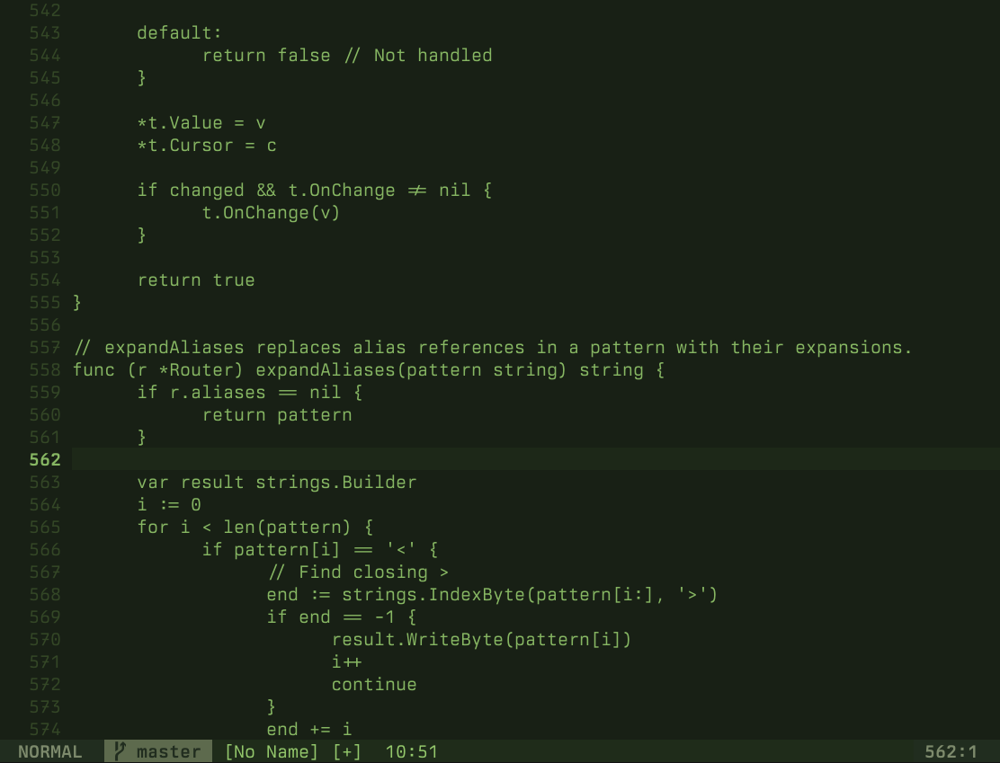
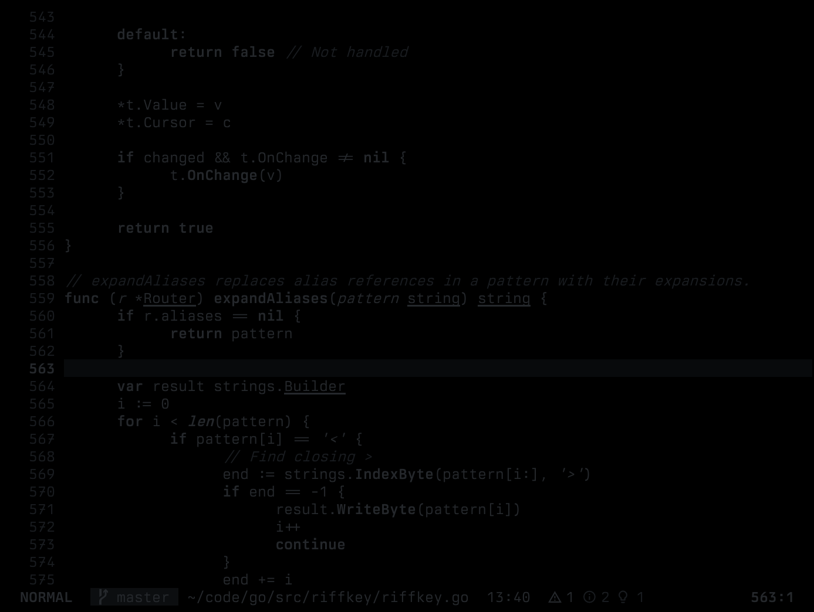

# mfd.nvim

Monotone colorschemes for Neovim. Aesthetic inspiration from [U.S. Graphics Company](https://usgraphics.com) — thanks for the beautiful work.

Nine variants, from phosphor CRTs to night vision.

## Themes

### mfd / mfd-dark
Olive sage.


### mfd-stealth
Green phosphor.


### mfd-amber
Amber phosphor.


### mfd-mono
White phosphor.


### mfd-scarlet
Deep red.


### mfd-paper
High contrast terminal.


### mfd-hud
Heads-up display.


### mfd-nvg
Night vision goggles.



### mfd-blackout
Covert lighting conditions.



## Installation

```lua
-- lazy.nvim
{
  'kungfusheep/mfd.nvim',
  lazy = false,
  priority = 1000,
  config = function()
    vim.cmd('colorscheme mfd-stealth')
  end,
}
```

## Approach

Syntax differentiation through text decoration, not colour:

- **Bold** — keywords, functions
- *Italic* — strings, comments, parameters
- <ins>Underline</ins> — types, structures

Lualine themes are included for each variant.

## Cursor sync

Each theme defines per-mode cursor highlights (`CursorNormal`, `CursorInsert`, `CursorVisual`, `CursorReplace`, `CursorCommand`). To sync these to your terminal cursor via OSC 12 (works with Ghostty, kitty, etc.):

```lua
{
  'kungfusheep/mfd.nvim',
  lazy = false,
  priority = 1000,
  config = function()
    vim.cmd('colorscheme mfd-stealth')

    vim.opt.guicursor = {
      "n:block-CursorNormal",
      "v:block-CursorVisual",
      "i:block-CursorInsert",
      "r-cr:block-CursorReplace",
      "c:block-CursorCommand",
    }

    require('mfd').enable_cursor_sync()
  end,
}
```
