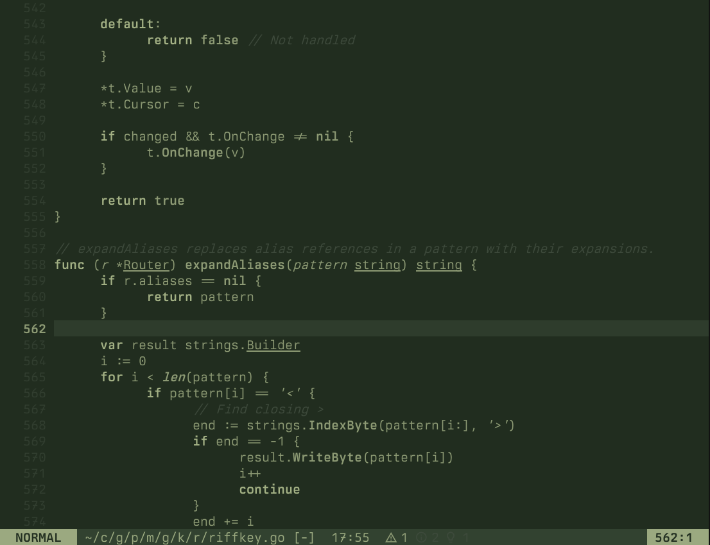
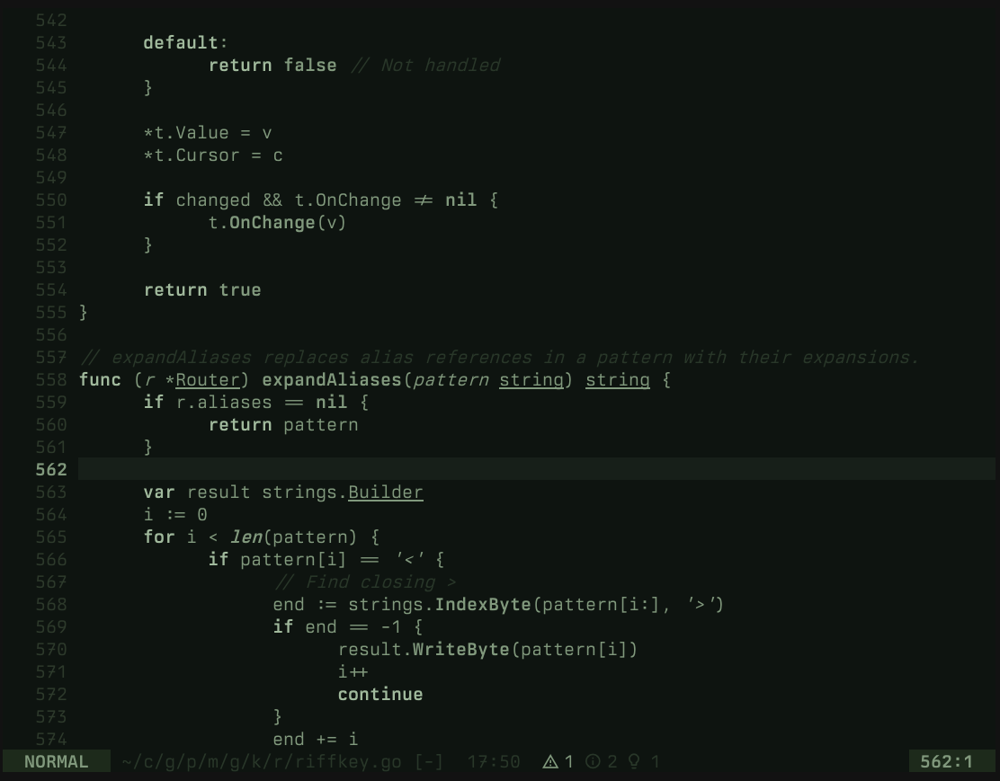
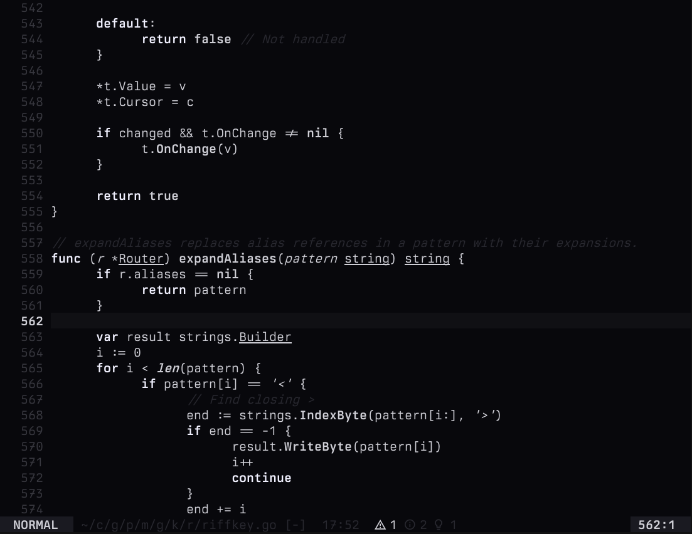
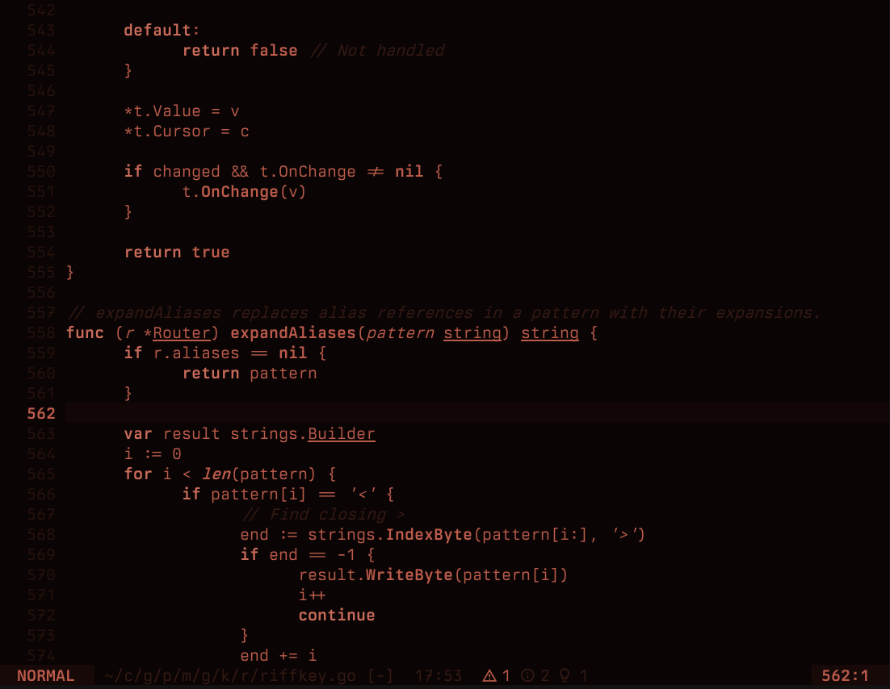
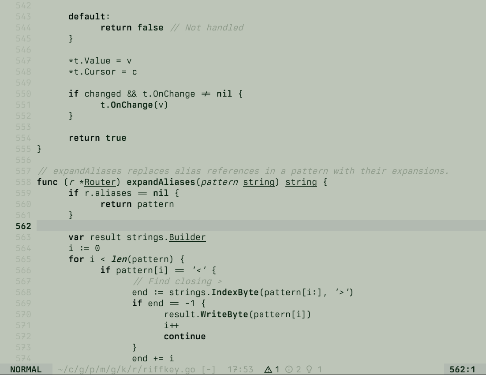

# mfd.nvim

Monotone colorschemes for Neovim. Aesthetic inspiration from [U.S. Graphics Company](https://usgraphics.com) — thanks for the beautiful work.

Seven variants, from phosphor CRTs to high contrast paper.

## Themes

### mfd / mfd-dark
Olive sage.




### mfd-stealth
Green phosphor.



### mfd-amber
Amber phosphor.


### mfd-mono
White phosphor.



### mfd-scarlet
Deep red.



### mfd-paper
High contrast terminal.



## Installation

```lua
-- lazy.nvim
{
  'kungfusheep/mfd.nvim',
  lazy = false,
  priority = 1000,
  config = function()
    vim.cmd('colorscheme mfd-stealth')
  end,
}
```

## Approach

Syntax differentiation through text decoration, not colour:

- **Bold** — keywords, functions
- *Italic* — strings, comments, parameters
- <ins>Underline</ins> — types, structures

Lualine themes are included for each variant.
